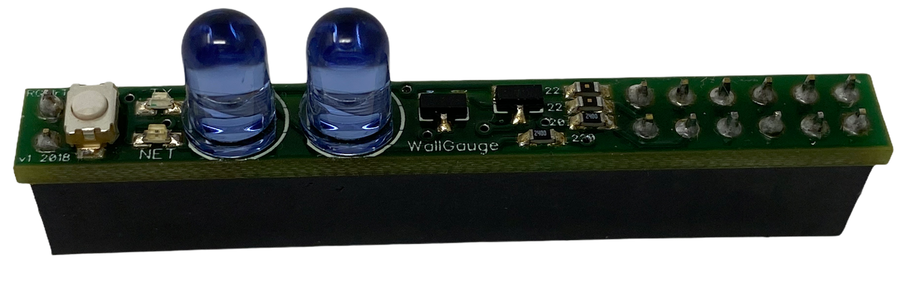
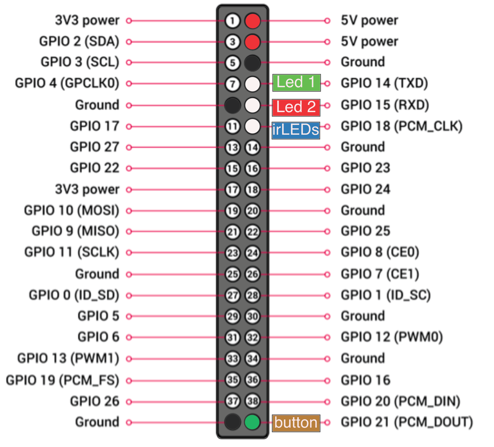

# GDT-PCB Infrared Printed Circuit Board

## Overview

The GDT-PCB is a small circuit board designed to plug into the Raspberry Pi Zero WH expansion header.  The PCB is soldered to the top of a 40 pin female header allowing it to easily slide on to the Raspberry Pi Zero WH male header. The GDT-PCB is fitted with two super-bright 5mm infrared (940nm) LEDs, red and green LEDs, and a normally open push button.

The GDT-PCB’s primary purpose is to send infrared data to a WallGauge in the same room. The push button and two LEDs are used for secondary functions such as starting the binding process to a smart phone and flashing a red LED to signal an error.  The layout, schematic, and communication protocol of the GDT-PCB are the property of WallGauge, LLC and not open source.  However the software that is used to encode data and send commands to a WallGauge are open source and can be found on this GitHub repo.

## Hardware

The two 5mm through-hole infrared LEDs (spec sheet) have a continuous forward current of 100 mA with a peak forward current of 1,000 mA.  GPIO-18 (pin 12) is used by the Raspberry Pi to switch on the two infrared LEDs.  The GDT-PCB utilizes two power transistors that drive the infrared LEDs well above their rated continuous current.  Therefor you should only turn on the infrared LED’s intermittently to send modulated data. We provide sample utilities as part of the open source library that will safely drive the LED’s if used correctly. 
Caution: If you turn on the infrared LED’s and leave them on, they will be permanently damaged.  Use the provided software in our open source library to drive the infrared LEDs.
The push button connected to GPIO-21 (pin 40) is a normally open momentary contact push button.  When pushed it grounds GPIO-21 (pin 40). You should configure the Raspberry Pi to set GPIO-21 (pin 40) as input and pulled high. The green LED connected to GPIO-14 (pin 8) and the red LED connected to GPIO-15 (pin 10) can be switched on (output high) to light up the LEDs.  These LEDs can be left on or off as long as you like as they are not driven above their rated long term forward current. 

## Handling

The GDT-PCB is sensitive to electrostatic discharge (ESD).  You must practice proper ESD handling techniques when handling the GDT-PCB.  Examples are using an electrostatic wrist strap and an ESD bench mat. 

## GDT-PCB Demo Software

We have included test software for making calls to this hardware in this GitHub repo.  The node.js class gaugeCmdTxClass.js can be used as a driver for sending commands to our GDT-PCB hardware.

### Hardware Requirements

1. Raspberry Pi Zero WH
1. WallGauge.com Gauge Data Transmitter - Printed Circuit Board (GDT-PCB).

### Software Requirements (must be installed before Install)

1. Raspbian
2. Node.js v10.18.1
3. git
4. pigpio `sudo apt-get update` and then `sudo apt-get install pigpio`

Warning! Do not change the Raspberry Pi's video memory allocation from the default value.  pigpio uses this memory for pin communications.

### Install

1) type: `git clone https://github.com/WallGauge/GDT-PCB.git`
2) then type: `cd GDT-PCB` and `npm install`
3) To run the test app type `node testMe`. If you get an error you may need to run it with the sudo command.  Running node scripts as root is not recommended for production apps.  

See the testMe.js app for an example of how to make calls to the GDT-PCB.
